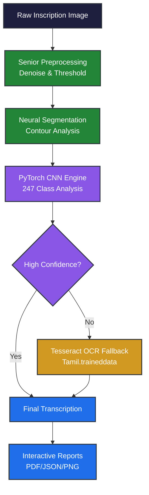

<!-- markdownlint-disable MD033 -->
<div align="center">

# 🏛️ Ancient Tamil Script Heritage AI
### *Advanced Neural Recognition & Heritage Preservation Dashboard*

**A professional, multi-engine Computer Vision pipeline designed to digitize, segment, and recognize ancient Tamil inscriptions from historical artifacts.**

[](https://www.python.org/)
[](https://pytorch.org/)
[](https://streamlit.io/)
[](https://opencv.org/)
[](https://github.com/tesseract-ocr/tesseract)

</div>
<!-- markdownlint-enable MD033 -->

---

## 📖 Project Vision
Ancient Tamil inscriptions are vital historical artifacts, yet their degradation makes manual transcription nearly impossible. This project bridges archaeology and Artificial Intelligence by providing a **Senior-level Production Dashboard** for real-time script recognition.

This engine doesn't just "guess"—it uses a **Multi-Engine Pipeline** combining custom-trained Deep Learning (CNN) with a specialized **Tesseract OCR Fallback** for high-confidence digitization.

---

## 🚀 Key Features

*   **⚡ Professional Dashboard**: Real-time interactive UI built with Streamlit for both Research and Production use.
*   **🧠 Hybrid Neural Pipeline**: 
    *   **Custom CNN (PyTorch)**: Optimized for 247 Tamil character classes.
    *   **Tesseract Fallback**: Automatic secondary verification using custom-trained `.traineddata` for low-confidence characters.
*   **🔬 Advanced Preprocessing**: 4-stage pipeline including Non-Local Means (NLM) Denoising and Gaussian Adaptive Thresholding.
*   **📊 Comprehensive Reporting**: Export results to PNG, PDF, or JSON with character-level confidence metrics and bounding box metadata.
*   **🛠️ Architectural Integrity**: Modular Python codebase using `dataclasses`, `caching`, and object-oriented design patterns.

---

## ✨ System Architecture



---

## 🛠️ Technology Stack

| Domain | Technology | Implementation |
| :--- | :--- | :--- |
| **Interface** | `Streamlit` | Production & Research Dashboards |
| **Neural Engine** | `PyTorch` | Custom 3-layer CNN with Weight Bridging |
| **OCR Fallback** | `Tesseract 5.x` | Secondary verification with `Tamil.traineddata` |
| **Vision** | `OpenCV` | NLM Denoising, Adaptive Thresholding, Contours |
| **Data** | `Pandas / NumPy` | Result serialization and matrix math |

---

## ⚙️ Installation & Quick Start

**1. Clone & Environment:**
```bash
git clone https://github.com/your-username/Ancient-Tamil-Script-Heritage-AI.git
cd tamil_heritage_ai
python -m venv venv_new
source venv_new/bin/activate  # venv_new\Scripts\activate on Windows
pip install -r requirements.txt
```

**2. Tesseract Setup:**
*   Install Tesseract OCR 5.x.
*   Ensure `Tamil.traineddata` is in the project root.
*   The dashboard will automatically detect and link the engine.

**3. Launch the Application:**
*   **Production Dashboard**: `streamlit run app.py` (Port 8501)
*   **Research Dashboard**: `streamlit run Model-Creation/main_app.py` (Port 8503)

---

## 🏃‍♂️ Operational Workflow

### **Phase 1: Production Dashboard (`app.py`)**
Designed for speed and ease of use. Upload a manuscript, adjust the denoising sliders, and get an instant Unicode transcription with confidence metrics.

### **Phase 2: Research Dashboard (`main_app.py`)**
An "inch-by-inch" replication of the research interface. Includes:
*   **Metric Cards**: Real-time detection stats and pipeline health.
*   **Multi-Tab Analysis**: Original grid, Annotated boxes, Zoom, and Table views.
*   **Export Engine**: Direct download of results in multiple formats.

---

## 🏗️ Heritage AI Standards

This project follows senior-level development patterns:
*   **Dynamic Pathing**: No hardcoded paths; works cross-platform.
*   **Weight Bridging**: Automatically adapts legacy 26-class or 50-class models to the modern 247-class Tamil architecture.
*   **State Persistence**: Uses Streamlit Session State for crash-proof analysis.

---

<!-- markdownlint-disable MD033 -->
<div align="center">
<i>Preserving the past by powering the future.</i>
</div>
<!-- markdownlint-enable MD033 -->
